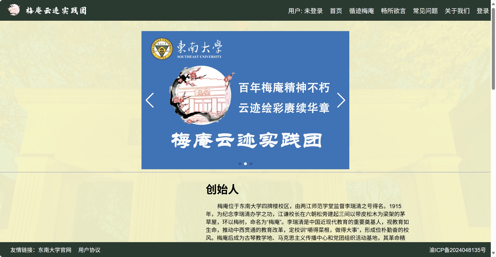
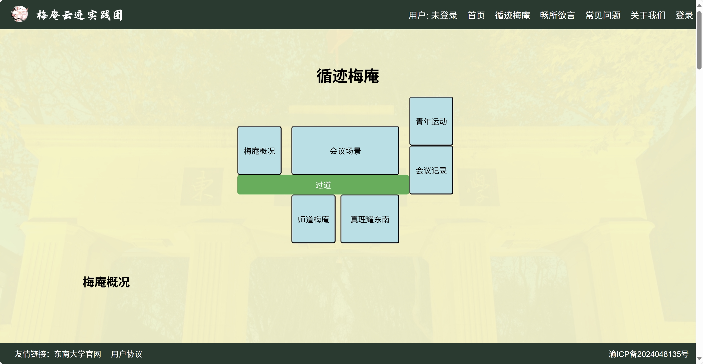
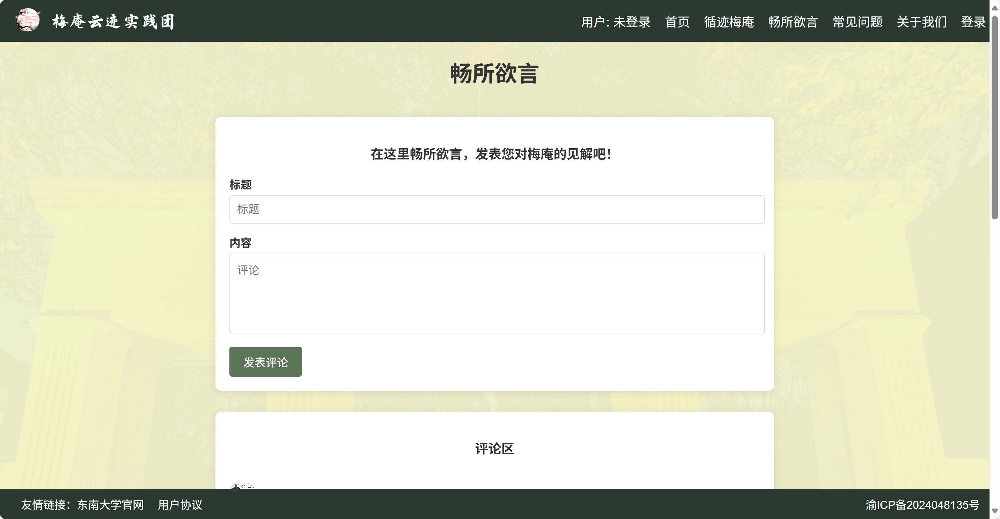
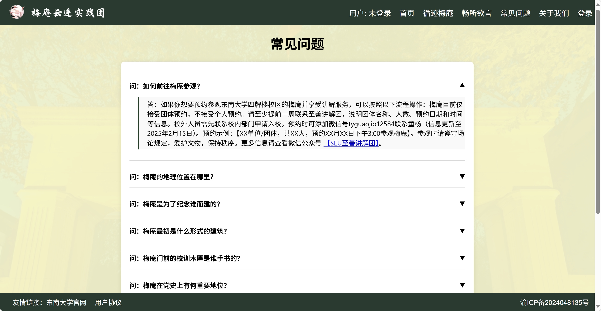
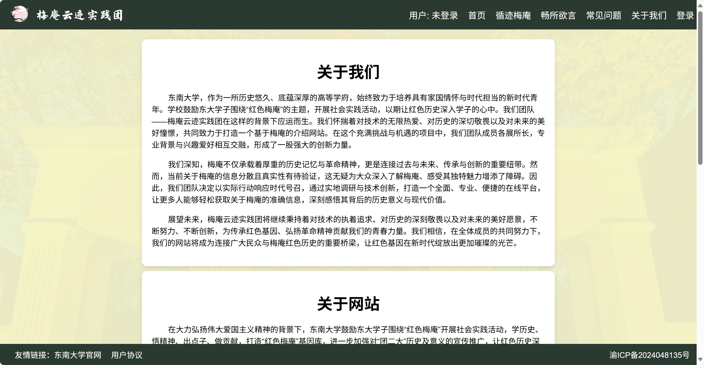

# 梅庵云迹网站介绍
[**English**](INTRODUCTION.md) | [简体中文](#)

本文档介绍的是网站本身。网站名称仍为“梅庵云迹 / Meian Cloud”，当前代码仓库则是原始项目 [`r1Way/meiancloud`](https://github.com/r1Way/meiancloud) 的重置版，现维护仓库为 [`WeiKnight0/meiancloud_rebirth`](https://github.com/WeiKnight0/meiancloud_rebirth)。若你希望了解项目结构、代码组成和部署方式，请查看根目录中的 [README.zh-cn.md](../README.zh-cn.md)。

## 网站定位
梅庵云迹是一个围绕东南大学梅庵历史文化而建设的文化传播与教育展示网站，目标是把分散的历史资料、展陈内容和参观相关信息整合为一个清晰、可访问、可互动的线上平台。

## 建设背景
梅庵不仅是东南大学校园中的重要历史空间，也承载着深厚的历史记忆与红色文化意义。现有相关资料往往分散在不同网页、文章和社交平台中，普通读者很难快速形成完整认知。

梅庵云迹的建设，正是为了通过统一的数字化平台解决这一问题。

## 网站作用
这个网站主要承担以下作用：
- 系统介绍梅庵的历史沿革与文化价值
- 帮助公众理解展厅内容与相关背景
- 提供线上交流与反馈渠道
- 提升相关信息的可获取性与可读性
- 让历史教育与数字传播结合起来

## 核心功能
### 历史文化展示
网站通过图文页面介绍梅庵的起源、相关历史人物、展陈空间以及更广泛的历史背景，帮助用户建立整体认识。

### 循迹浏览
“循迹梅庵”板块将用户从整体介绍引导到更具体的展厅内容，让线上浏览更接近线下参观的理解路径。

### 互动交流
注册用户可以在评论区发表意见、提问和回复他人，使网站不仅是展示平台，也具备持续收集反馈和促进讨论的能力。

### 常见问题支持
网站设置了常见问题板块，用于集中回答高频问题，降低用户获取信息时的理解门槛。

### 用户系统
用户可以注册、登录并维护个人资料，从而更完整地参与互动内容。

### 关于我们与项目背景
网站还包含“关于我们”页面，用于介绍团队背景、项目动机以及相关联系渠道。

## 面向用户
- 东南大学校内师生
- 对梅庵和校园历史感兴趣的访客
- 青年实践团队与讲解传播团队
- 关注红色文化、近现代史和数字人文传播的读者

## 文化与教育意义
梅庵云迹的意义并不只是介绍一个建筑或一个校园景点，更重要的是帮助更多人理解梅庵所承载的历史背景、革命记忆与教育价值。

通过线上整理与传播，项目把原本分散的历史知识转化为更容易学习、回顾和分享的内容。

## 数字化价值
这个网站体现了数字技术在历史文化传播中的现实价值：
- 降低信息分散带来的理解成本
- 提高公众接触历史资料的便利性
- 让教育内容具备更好的浏览体验
- 在线下文化遗产与线上传播之间建立连接

## 使用方式
典型使用路径如下：
1. 进入首页，先了解梅庵的整体主题与背景。
2. 浏览历史介绍与展陈内容页面。
3. 查看常见问题，快速获取重点信息。
4. 如需互动，可注册或登录后参与评论区讨论。

## 未来展望
后续可以继续扩展的方向包括：
- 更丰富的展陈资料与档案整理
- 更完善的多语言支持
- 更完整的参观指引信息
- 更成熟的社区运营与审核机制

## 相关文档
- 开发者说明：[../README.zh-cn.md](../README.zh-cn.md)
- English introduction: [INTRODUCTION.md](INTRODUCTION.md)
